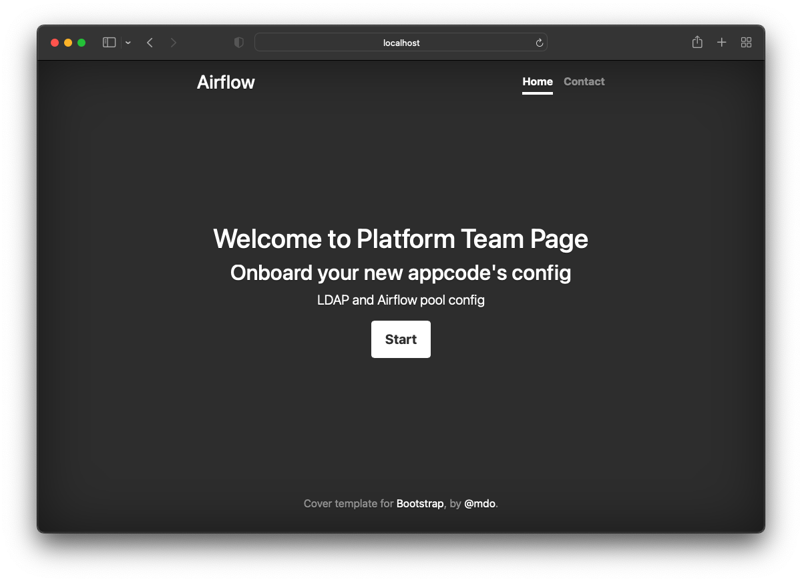
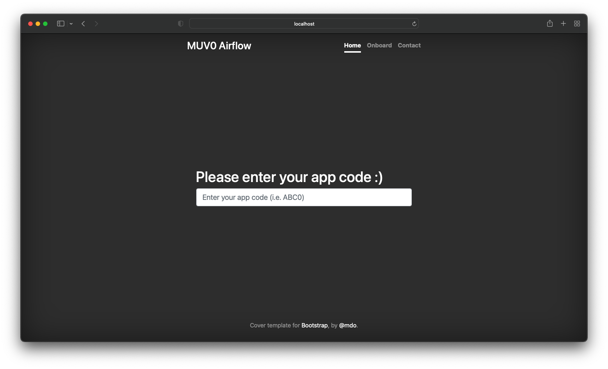
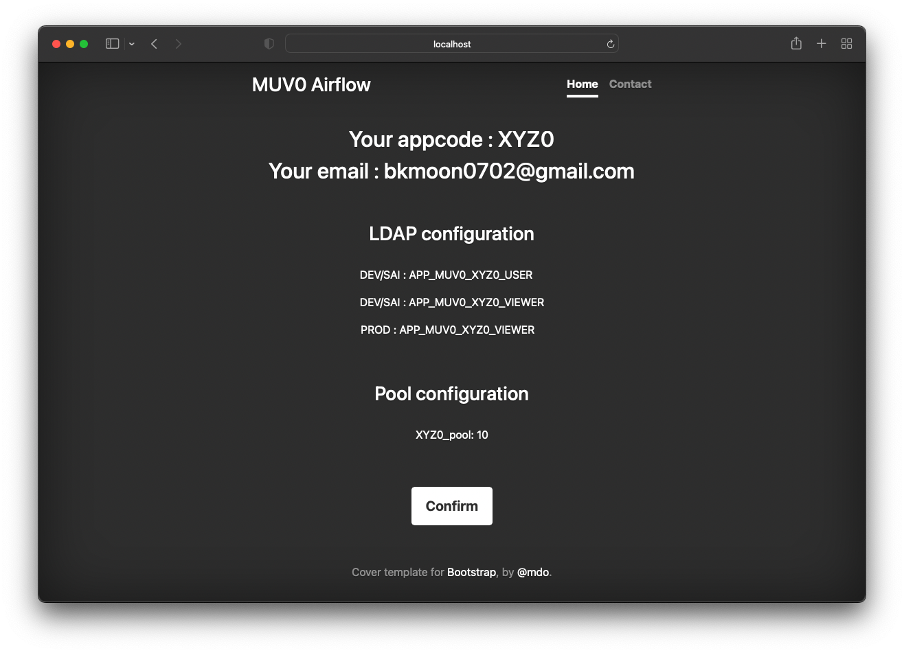
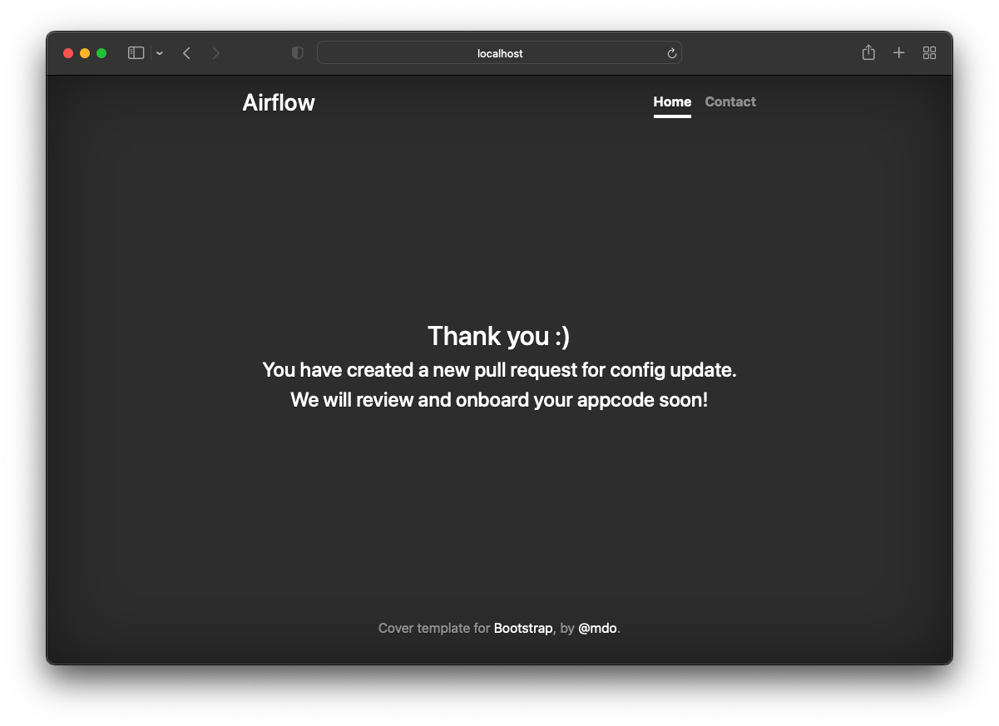
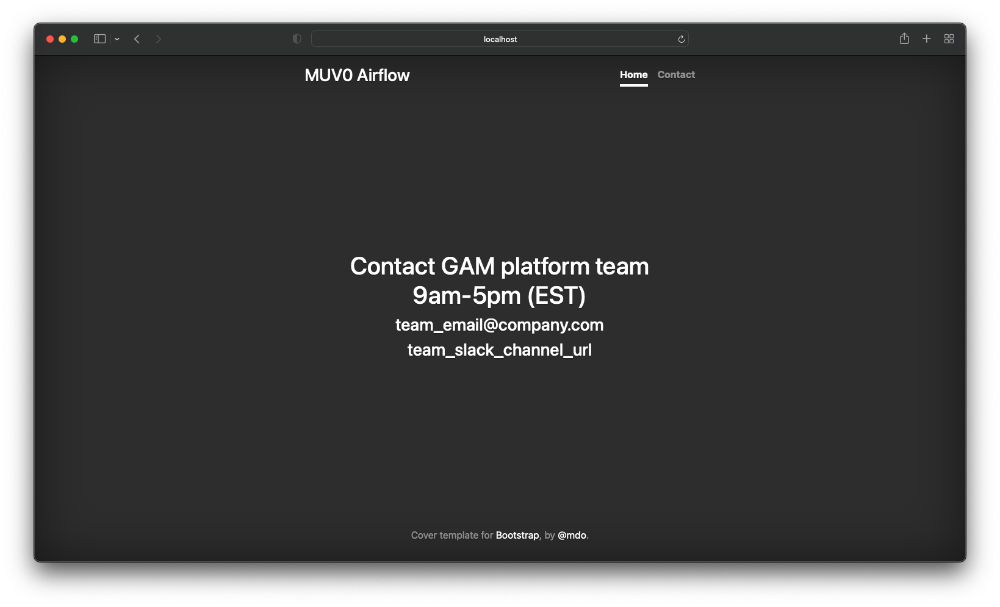
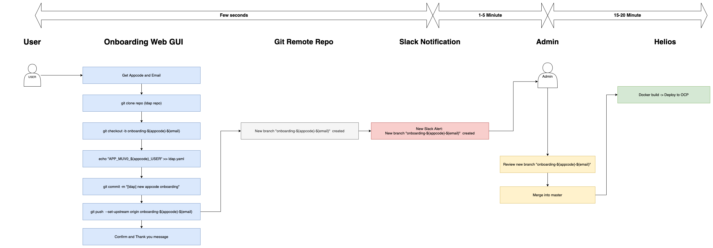
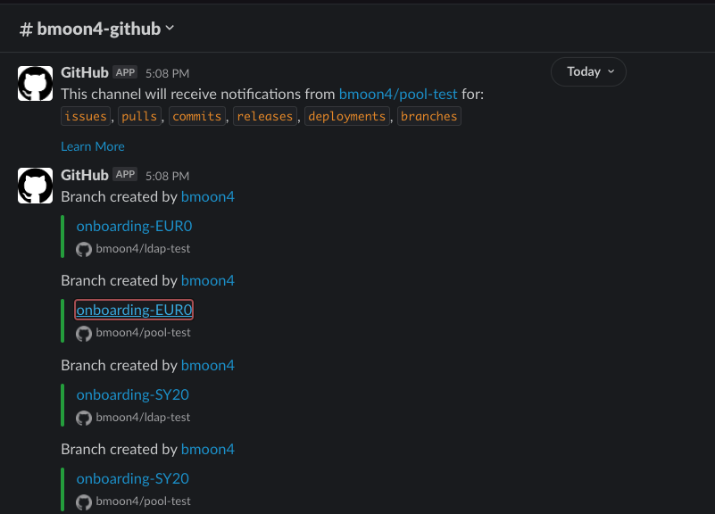

# flask-airflow-onboarding

Flask app to onboard new appcode + Airflow ldap and pool changes.

# Main page



# Onboard page


.png)


# Confirm page

# Contact page


# How this work?



1. User adds input `appcode (i.e, ABC0)` and `email(employee@company.com)`
2. App will clone ldap repo and pool repo and create a new branch (`git checkout -b onboarding-${appcode}-${email}`)
3. Add new config and push the new branch into remote
4. Slack git bot will detect new branch creation and send notifications to admin
5. Admin review the new branch/PR and merge into master


# New branch creation from flask app

Following branches are newly created from flask app
## LDAP

.png)
.png)

## Pool

.png)
.png)


# Slack Notification (Git repo <-> Slack)

App admin can subscribe git repo's changes using Slack



Once admin gets this nofication, they will review the new branche and merge into master.
# Flask app log
```
172.17.0.1 - - [10/Jun/2022 22:35:38] "GET /static/css/cover.css HTTP/1.1" 304 -

your appcode:  ABC0

your email:  bkmoon0702@gmail.com

172.17.0.1 - - [10/Jun/2022 22:35:42] "POST /submit HTTP/1.1" 200 -

Received appcode: ABC0

LDAP DEV/QA/UAT: APP_ABC0_USER

LDAP PROD: APP_ABC0_VIEWER

Pool: ABC0_pool: 10

############################# LDAP setup ###############################

172.17.0.1 - - [10/Jun/2022 22:35:42] "GET /static/css/cover.css HTTP/1.1" 304 -

git clone

172.17.0.1 - - [10/Jun/2022 22:35:42] "GET /dist/js/bootstrap.min.js HTTP/1.1" 404 -

172.17.0.1 - - [10/Jun/2022 22:35:42] "GET /assets/js/vendor/popper.min.js HTTP/1.1" 404 -

Cloning into 'temp'...

172.17.0.1 - - [10/Jun/2022 22:35:42] "GET /static/css/bootstrap.min.css HTTP/1.1" 304 -

git checkout -b

Switched to a new branch 'onboarding-ABC0-bkmoon0702@gmail.com'

add changes

git add .

git commit

[onboarding-ABC0-bkmoon0702@gmail.com 75f35ea] [ldap] new appcode onboarding

 4 files changed, 4 insertions(+)

To https://github.com/bmoon4/ldap-test.git

 ! [rejected]        onboarding-ABC0-bkmoon0702@gmail.com -> onboarding-ABC0-bkmoon0702@gmail.com (non-fast-forward)

error: failed to push some refs to 'https://github.com/bmoon4/ldap-test.git'

hint: Updates were rejected because the tip of your current branch is behind

hint: its remote counterpart. Integrate the remote changes (e.g.

hint: 'git pull ...') before pushing again.

hint: See the 'Note about fast-forwards' in 'git push --help' for details.

warn: No match for commit 75f35ea0a5f1fb5b5dd2eae62c99b3e1531ada68 found at https://github.com/bmoon4/ldap-test

warn: Are you sure you pushed 'onboarding-ABC0-bkmoon0702@gmail.com' there?

The following changes since commit a99c4ab4defadab7ccd51e3a4cb240c9bd9df96c:


  make more generic (2022-06-10 18:19:16 -0400)


are available in the Git repository at:


  https://github.com/bmoon4/ldap-test onboarding-ABC0-bkmoon0702@gmail.com


for you to fetch changes up to 75f35ea0a5f1fb5b5dd2eae62c99b3e1531ada68:


  [ldap] new appcode onboarding (2022-06-10 22:35:42 +0000)


----------------------------------------------------------------

root (1):

      [ldap] new appcode onboarding


 configs/dev/ldap.yaml  | 1 +

 configs/prod/ldap.yaml | 1 +

 configs/qa/ldap.yaml   | 1 +

 configs/uat/ldap.yaml  | 1 +

 4 files changed, 4 insertions(+)

############################# Pool setup ###############################

git clone

Cloning into 'temp'...

git checkout -b

Switched to a new branch 'onboarding-ABC0-bkmoon0702@gmail.com'

add changes

git add .

git commit

[onboarding-ABC0-bkmoon0702@gmail.com 68296a1] [pool] new appcode onboarding

 4 files changed, 4 insertions(+)

To https://github.com/bmoon4/pool-test.git

 ! [rejected]        onboarding-ABC0-bkmoon0702@gmail.com -> onboarding-ABC0-bkmoon0702@gmail.com (non-fast-forward)

error: failed to push some refs to 'https://github.com/bmoon4/pool-test.git'

hint: Updates were rejected because the tip of your current branch is behind

hint: its remote counterpart. Integrate the remote changes (e.g.

hint: 'git pull ...') before pushing again.

hint: See the 'Note about fast-forwards' in 'git push --help' for details.

warn: No match for commit 68296a1f0b24477df4863e5c2089c8c8d99802f4 found at https://github.com/bmoon4/pool-test

warn: Are you sure you pushed 'onboarding-ABC0-bkmoon0702@gmail.com' there?

The following changes since commit 7c0d7036d43215322ff87e92bcca1da3377d4c64:


  init (2022-06-08 11:22:10 -0400)


are available in the Git repository at:


  https://github.com/bmoon4/pool-test onboarding-ABC0-bkmoon0702@gmail.com


for you to fetch changes up to 68296a1f0b24477df4863e5c2089c8c8d99802f4:


  [pool] new appcode onboarding (2022-06-10 22:35:43 +0000)


----------------------------------------------------------------

root (1):

      [pool] new appcode onboarding


 configs/dev/pools.yaml  | 1 +

 configs/prod/pools.yaml | 1 +

 configs/qa/pools.yaml   | 1 +

 configs/uat/pools.yaml  | 1 +

 4 files changed, 4 insertions(+)
```
