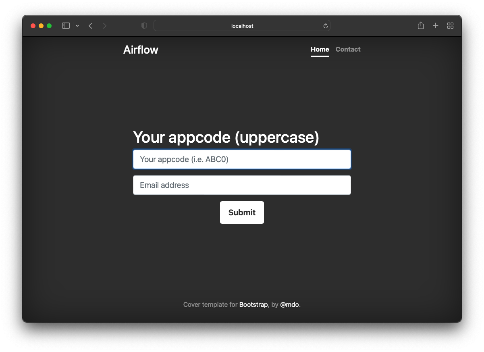

# flask-airflow-onboarding

Flask app to deploy ldap.yaml and airflow_pool.yaml changes

# Main page


# Onboard page

(Backend logic is not ready yet.. WIP)



# Contact page


# How this work?

1. User adds input `appcode (i.e, ABC0)` through webpage
2. App pulls `airflow ldap git repo` and creates a new branch (i.e. onboarding-ABC0)
3. `echo APP_MUV0_ABC0_USER >> DEV/ldap.yaml` and pushes the change into repo
```
# DEV
echo APP_MUV0_ABC0_USER >> DEV/ldap.yaml

# QA
echo APP_MUV0_ABC0_USER >> QA/ldap.yaml

#UAT
echo APP_MUV0_ABC0_USER >> UAT/ldap.yaml

#PROD
echo APP_MUV0_ABC0_VIEWER >> PROD/ldap.yaml
```
4. App pulls `airflow pool git repo` and creates a new branch (i.e. onboarding-ABC0)
5. `echo ABC0_pool=10 >> DEV/pool.yaml` and pushes the change into repo (10 slots by default)

```
# DEV
echo ABC0_pool=10 >> DEV/pool.yaml

# QA
echo ABC0_pool=10 >> QA/pool.yaml

#UAT
echo ABC0_pool=10 >> UAT/pool.yaml

#PROD
echo ABC0_pool=10 >> PROD/pool.yaml
```
6. Jenkins pipeline will trigger new build -> deploy into Openshift

