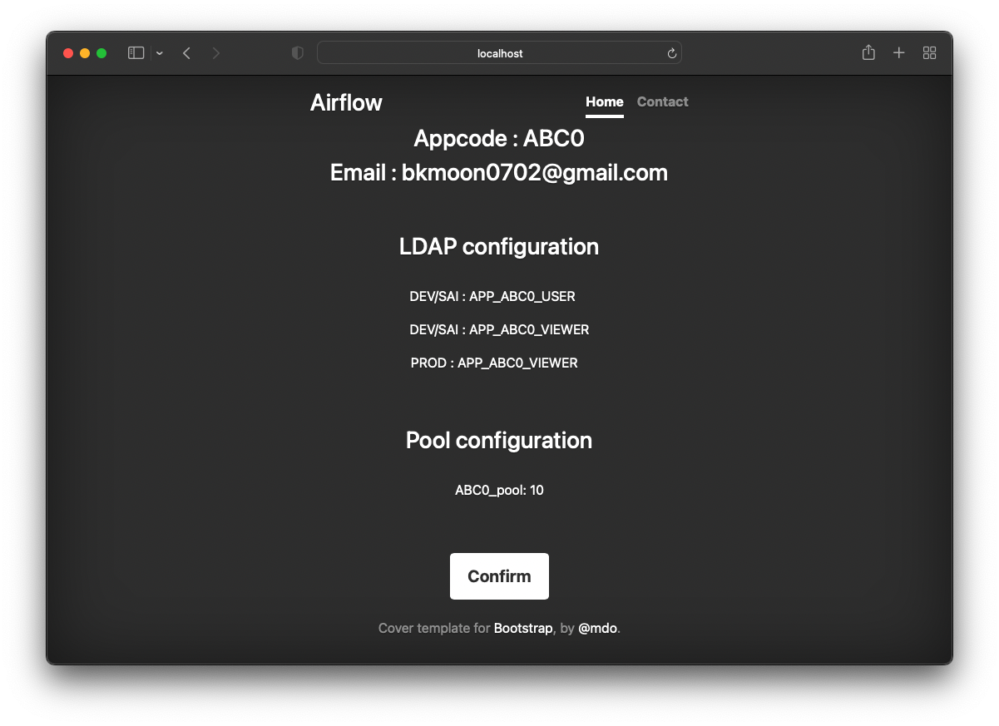
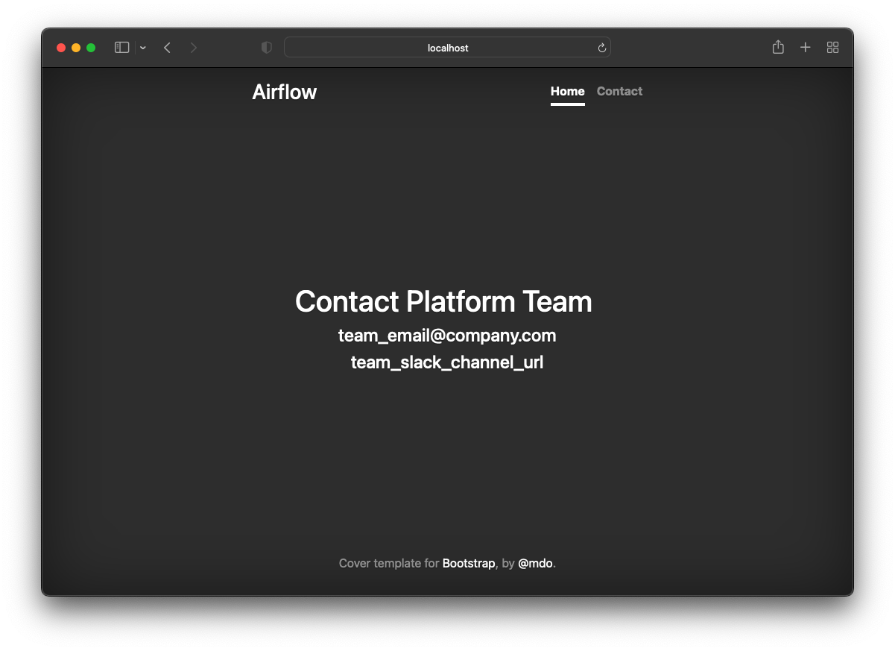
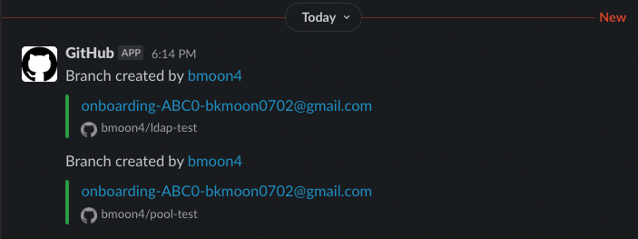

# flask-airflow-onboarding

Flask app to onboard new appcode + Airflow ldap and pool changes.

# Main page


# Onboard page


.png)


# Confirm page

# Contact page


# How this work?

1. User adds input `appcode (i.e, XYZ0)` and `email(employee@company.com)`
2. App will clone ldap repo and pool repo and create a new branch (`git checkout -b onboarding-${app_code}-${email}`)
3. Add new config and push the new branch into remote
4. Slack git bot will detect new branch creation and send notifications to admin
5. Admin review the new branch/PR and merge into master


# New branch creation from flask app

Following branches are newly created from flask app
## LDAP

.png)
.png)

## Pool

.png)
.png)


# Slack Notification (Git repo <-> Slack)

App admin can subscribe git repo's changes using Slack



Once admin gets this nofication, they will review the new branche and merge into master.
# Flask app log
```
* Serving Flask app 'app' (lazy loading)

 * Environment: production

   WARNING: This is a development server. Do not use it in a production deployment.

   Use a production WSGI server instead.

 * Debug mode: on

 * Running on all addresses.

   WARNING: This is a development server. Do not use it in a production deployment.

 * Running on http://172.17.0.2:3000/ (Press CTRL+C to quit)

 * Restarting with stat

 * Debugger is active!

 * Debugger PIN: 979-184-803

172.17.0.1 - - [08/Jun/2022 21:19:51] "GET / HTTP/1.1" 200 -

172.17.0.1 - - [08/Jun/2022 21:19:51] "GET /dist/js/bootstrap.min.js HTTP/1.1" 404 -

...

Received appcode: ABC0

LDAP DEV/QA/UAT: APP_MUV0_ABC0_USER

LDAP PROD: APP_MUV0_ABC0_VIEWER

Pool: ABC0_pool: 10

############################# LDAP setup ###############################

git clone

git checkout -b

add changes

git add .

git commit

[onboarding-ABC0-bkmoon0702@gmail.com 3dbe84d] [ldap] new appcode onboarding

 4 files changed, 4 insertions(+)

Branch 'onboarding-ABC0-bkmoon0702@gmail.com' set up to track remote branch 'onboarding-ABC0-bkmoon0702@gmail.com' from 'origin'.

The following changes since commit a47a68e256709e7a19053fc0ce81d391ed1800bb:


  init (2022-06-08 11:18:26 -0400)


are available in the Git repository at:


  https://github.com/bmoon4/ldap-test onboarding-ABC0-bkmoon0702@gmail.com


for you to fetch changes up to 3dbe84d759a9ae69448c1ebca20747d292fd3840:


  [ldap] new appcode onboarding (2022-06-08 21:20:02 +0000)


----------------------------------------------------------------

root (1):

      [ldap] new appcode onboarding


 configs/dev/ldap.yaml  | 1 +

 configs/prod/ldap.yaml | 1 +

 configs/qa/ldap.yaml   | 1 +

 configs/uat/ldap.yaml  | 1 +

 4 files changed, 4 insertions(+)

############################# Pool setup ###############################

git clone

git checkout -b

add changes

git add .

git commit

[onboarding-ABC0-bkmoon0702@gmail.com 802d7ba] [pool] new appcode onboarding

 4 files changed, 4 insertions(+)

Branch 'onboarding-ABC0-bkmoon0702@gmail.com' set up to track remote branch 'onboarding-ABC0-bkmoon0702@gmail.com' from 'origin'.

The following changes since commit 7c0d7036d43215322ff87e92bcca1da3377d4c64:


  init (2022-06-08 11:22:10 -0400)


are available in the Git repository at:


  https://github.com/bmoon4/pool-test onboarding-ABC0-bkmoon0702@gmail.com


for you to fetch changes up to 802d7ba38d1051cebb4fea841cd536b60d9b1e56:


  [pool] new appcode onboarding (2022-06-08 21:20:04 +0000)


----------------------------------------------------------------

root (1):

      [pool] new appcode onboarding


 configs/dev/pools.yaml  | 1 +

 configs/prod/pools.yaml | 1 +

 configs/qa/pools.yaml   | 1 +

 configs/uat/pools.yaml  | 1 +

 4 files changed, 4 insertions(+)

Cloning into 'temp'...

172.17.0.1 - - [08/Jun/2022 21:20:02] "GET /assets/js/vendor/popper.min.js HTTP/1.1" 404 -

172.17.0.1 - - [08/Jun/2022 21:20:02] "GET /static/css/bootstrap.min.css HTTP/1.1" 304 -

172.17.0.1 - - [08/Jun/2022 21:20:02] "GET /dist/js/bootstrap.min.js HTTP/1.1" 404 -

172.17.0.1 - - [08/Jun/2022 21:20:02] "GET /static/css/cover.css HTTP/1.1" 304 -

Switched to a new branch 'onboarding-ABC0-bkmoon0702@gmail.com'

remote:

remote: Create a pull request for 'onboarding-ABC0-bkmoon0702@gmail.com' on GitHub by visiting:

remote:      https://github.com/bmoon4/ldap-test/pull/new/onboarding-ABC0-bkmoon0702@gmail.com

remote:

To https://github.com/bmoon4/ldap-test.git

 * [new branch]      onboarding-ABC0-bkmoon0702@gmail.com -> onboarding-ABC0-bkmoon0702@gmail.com

Cloning into 'temp'...

Switched to a new branch 'onboarding-ABC0-bkmoon0702@gmail.com'

remote:

remote: Create a pull request for 'onboarding-ABC0-bkmoon0702@gmail.com' on GitHub by visiting:

remote:      https://github.com/bmoon4/pool-test/pull/new/onboarding-ABC0-bkmoon0702@gmail.com

remote:

To https://github.com/bmoon4/pool-test.git

 * [new branch]      onboarding-ABC0-bkmoon0702@gmail.com -> onboarding-ABC0-bkmoon0702@gmail.com

172.17.0.1 - - [08/Jun/2022 21:20:28] "GET /confirm HTTP/1.1" 200 -

172.17.0.1 - - [08/Jun/2022 21:20:28] "GET /assets/js/vendor/popper.min.js HTTP/1.1" 404 -

...
```
